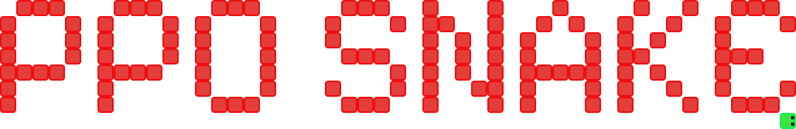

 

> [!NOTE]  
> Python 3.11.9 used 4 this project

 

# 📖 INDEX:
 * project overview
 * model structure
 * reward system
 * model input
 * project structure
 * train (with params explained)
 * play (with params explained)
 * debug scripts
 * licence

 

 

SPECIAL THANKS TO:
 [Eric Yang Yu](https://ericyangyu.github.io/) for the PPO [tutorial](https://medium.com/analytics-vidhya/coding-ppo-from-scratch-with-pytorch-part-1-4-613dfc1b14c8) and [Ettore](https://sa1g.github.io) for helping me in general.
