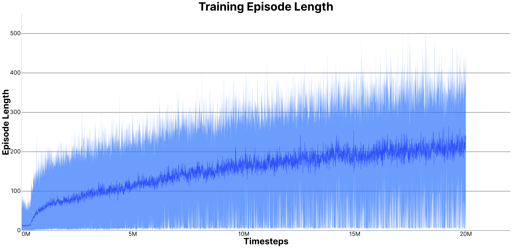

 

# 📖 INDEX:
 * 📌 [Project Overview](#-project-overview)
 * 🤖 [Model Structure](#-model-structure)
 * reward system
 * model input
 * project structure
 * train (with params explained)
 * play (with params explained)
 * debug scripts
 * 🤝 [Credits](#-credits)
 * 📄 [Licence](#-licence)

 
 
 
 

# 📌 Project Overview

> [!NOTE]  
> Python 3.11.9 used 4 this project

This project was made to use **PPO** *(Proximal Policy Optimization)* to beat the game of [**snake**](https://en.wikipedia.org/wiki/Snake_(video_game_genre))

 
 

# 🤖 Model Structure

 *Le applicazioni front-end mandano le richieste all'API che è l'unico che può comunicare con il ML grazie ad un **HMAC***
 

 
 

# 🤝 Thanks
SPECIAL THANKS TO:
 [Eric Yang Yu](https://ericyangyu.github.io/) for the PPO [tutorial](https://medium.com/analytics-vidhya/coding-ppo-from-scratch-with-pytorch-part-1-4-613dfc1b14c8) and [Ettore](https://sa1g.github.io) for helping me in general.

 
 

# 📄 Licence
This project was released under [MIT License](https://github.com/paolomalgarin/snake-ppo/blob/main/LICENSE.txt).
