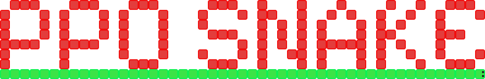
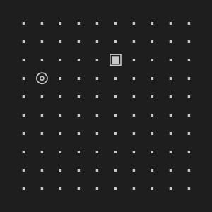
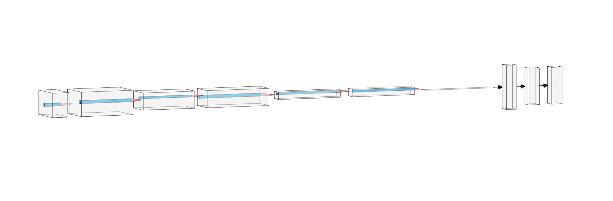
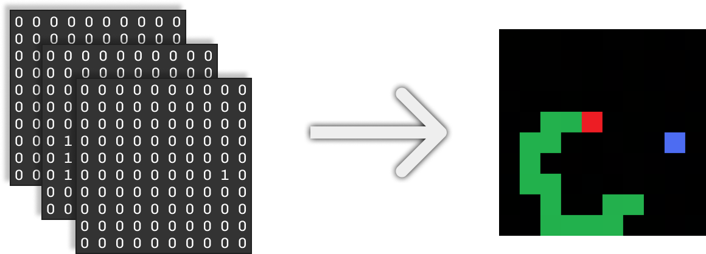
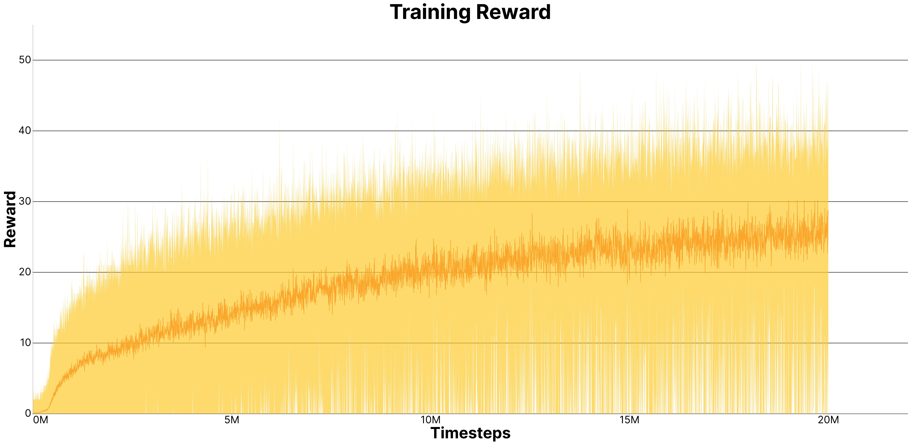

<p align=center>
   <i>Using PPO to beat snake.</i>
</p>
<br>
  
> [!NOTE]  
> Python 3.12 was used for this project


<br>
<br>


# 📖 INDEX:
 * 📌 [Project Overview](#-project-overview)
 * 🌐 [Model Structure](#-model-structure)
 * 🥇 [Reward Shaping](#-reward-shaping)
 * 👀 [Model Input](#-model-input)
 * 🎖️ [Resoults](#️-resoults)
 * 🚀 [Project Structure](#-project-structure)
    * 🎮 [Play](#-play)
    * 💪 [Train](#-train)
    * 📈 [Plot](#-plot)
    * 📊 [Debug Scripts](#-debug-scripts)
 * 🤝 [Credits](#-credits)
 * 📄 [Licence](#-licence)

<br>
<br>
<br>
<br>


# 📌 Project Overview

This project was made with the goal of using [**PPO**](https://en.wikipedia.org/wiki/Proximal_policy_optimization) *(Proximal Policy Optimization)* to beat the game of [**snake**](https://en.wikipedia.org/wiki/Snake_(video_game_genre)).   
The main goal was to train a reinforcement learning agent capable of learning the game from scratch.  
Along the way, this project became a deep dive into PPO: understanding how it works, tuning hyperparameters, stabilizing training, and analyzing learning behavior through metrics. 

> Here is a gameplay demo of the final agent trained for 20M timesteps  
> (You can find the model in `/agent/pretrained_model.pth`)

<p align=center>
   
</p>

<br>
<br>

# 🌐 Model Structure

The `ppo_agent.py` file contains 2 classes:
- The **PPOAgent** class, wich contains an implementation of the PPO algorithm
- The **FeedForwardNN** class, wich is the **ActorCritic** model

The **ActorCritic** model is made of a **CNN** with 3 convolutional layers that goes from 32 features to 64 and 2 fully connected layers of 32 neurons each
 



<br>
<br>

# 🥇 Reward Shaping

The reward shaping is quite simple: **only +1 if the snake eats** food and when the snake dies, it simply starts a new game.  
This reward shaping might seem too sparse for PPO but out of all the rewards shaping I've tryied, it performed the best.

<br>
<br>

# 👀 Model Input

lorem ipsum dolor sit amet ...


<br>
<br>

# 🎖️ Resoults

After training the model for 20M timesteps, here are the resoults:

> This is the reward graph, wich shows the model learning and gatting more reward.  
> This is also the score graph since score and reward coincide.


  
> This is the episode length graph.
> It represents the duration of the games during training.


<br>
<br>

# 🚀 Project Structure

lorem ipsum dolor sit amet ...

 - ## 🎮 Play
    lorem ipsum dolor sit amet ...

 - ## 💪 Train
    lorem ipsum dolor sit amet ...  
    ```json
    {  
        "agent": {  
            "timestamps_per_batch": 4800,  
            "max_timestamps_per_episode": 1600,  
            "gamma": 0.95,  
            "n_updates_per_iteration": 5,  
            "clip": 0.2,  
            "lr": 0.0003  
        },  
        "env": {  
            "max_steps": 1000,  
            "obs_shape": [  
                3,  
                10,  
                10  
            ],  
            "action_shape": [ 4 ]  
        }  
    }
    ```

 - ## 📈 Plot
    lorem ipsum dolor sit amet ...

 - ## 📊 Debug Scripts
    lorem ipsum dolor sit amet ...

<br>
<br>

# 🤝 Credits
Special thanks to [Eric Yang Yu](https://ericyangyu.github.io/) for the [PPO tutorial](https://medium.com/analytics-vidhya/coding-ppo-from-scratch-with-pytorch-part-1-4-613dfc1b14c8) and [Ettore](https://sa1g.github.io) for helping me with debugging.


<br>
<br>

# 📄 Licence
This project was released under [MIT License](https://github.com/paolomalgarin/snake-ppo/blob/main/LICENSE.txt).
