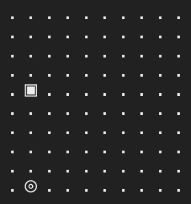
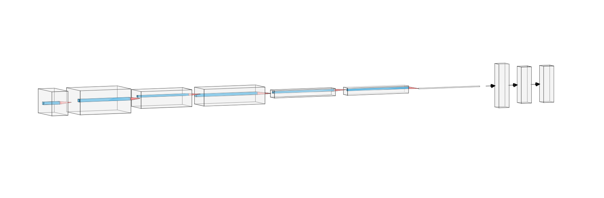
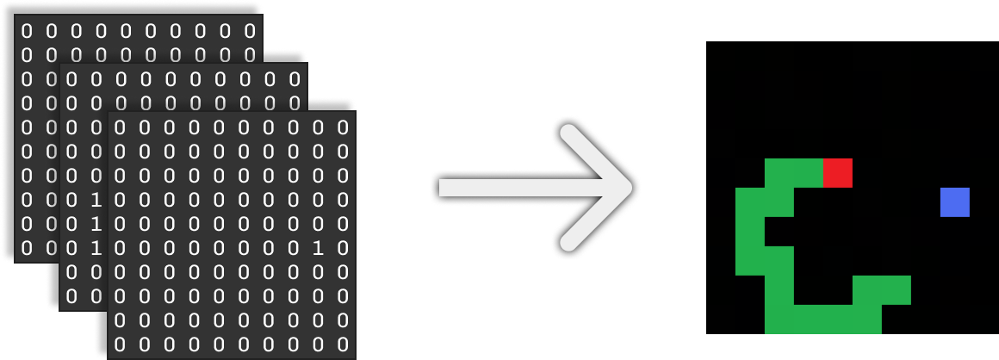

<p align=center>
   <i>Using PPO to beat snake.</i>
</p>
<br>
  
> [!NOTE]  
> This project was developed using Python 3.12


<br>
<br>


# 📖 INDEX:
 * 📌 [Project Overview](#-project-overview)
 * 🌐 [Model Structure](#-model-structure)
 * 🥇 [Reward Shaping](#-reward-shaping)
 * 👀 [Model Input](#-model-input)
 * 🎖️ [Results](#️-results)
 * ✨ [Try Yourself](#-try-yourself)
   * 💪 [Train an agent](#-train-an-agent)
   * 🎮 [Try Yourself](#-try-yourself)
 * 🤝 [Credits](#-credits)
 * 📄 [License](#-license)

<br>
<br>
<br>
<br>


# 📌 Project Overview

This project aims to use [**PPO**](https://en.wikipedia.org/wiki/Proximal_policy_optimization) *(Proximal Policy Optimization)* to beat the game of [**snake**](https://en.wikipedia.org/wiki/Snake_(video_game_genre)).   
The main goal was to train a reinforcement learning agent capable of mastering the game from scratch.  
Along the way, this project became a deep dive into PPO: understanding how it works, tuning hyperparameters, stabilizing training, and analyzing learning behavior through metrics. 

> Here are some gameplay demos of final agents trained for millions of timesteps  
> (You can find the models in `/agent/pretrained_models/`)

<p align=center style="display: flex; justify-content: center; width: 100%;">
     
    
    
    
   
</p>


<br>
<br>

# 🌐 Model Structure

The `ppo_agent.py` file contains 2 classes:
- The **PPOAgent** class, which contains an implementation of the PPO algorithm
- The **FeedForwardNN** class, which is the **ActorCritic** model

The **ActorCritic** model consists of a **CNN** with convolutional layers that increase from 32 to 64 feature maps, followed by 2 fully connected layers of 32 neurons each
 



<br>
<br>

# 🥇 Reward Shaping

The reward function is intentionally minimal: only **+1 if the snake eats** food and **-1 when the snake dies or doesn't eat** for too long. Finally **+30 when the snake wins**.  
This reward shaping might seem too sparse for PPO, but out of all the rewards shaping functions I've tried, it performed the best.

<br>
<br>

# 👀 Model Input

The agent receives an observation tensor of shape **(C, H, W)** directly from the environment.  
In this project the shape is (4, grid_size, grid_size):  
- Channel 0 → Snake **head** position  
- Channel 1 → Snake **body** positions  
- Channel 2 → **Food** position  
- Channel 3 → **Direction** one-hot  
  
*Each channel is a binary grid (0 or 1) aligned with the game board.  
Before being passed to the network, the observation is batched to shape (N, 4, grid_size, grid_size) for PyTorch.*



<br>
<br>

# 🎖️ Results

After training the model for 20M timesteps, here are the results:


| Grid Size | Training Timesteps | Mean score | Win % |
|   :---:   |       :---:        |    :---:   | :---: |
| 10 x 10   |     20.000.000     |    80/99   |  63%  |
|  6 x 6    |      3.000.000     |    34/35   |  95%  |
|  4 x 4    |      1.000.000     |    15/15   |  99%  |  

<br>

<p style="display: flex; justify-content: center; width: 100%;">
  
</p>

> This is the score graph *(of the 6x6 snake)*, which shows the model score during training.  

<br>
<br>
<br>

# ✨ Try Yourself
Here are the instructions for running experiments and having fun with the agents yourself.

<br>

## 💪 Train an agent
*(If you want to make another training script, you can simply use `model.learn(timesteps)`)*  
```ps
py train.py --grid-size 6 --train-ts 3_000_000 --vf 250_000 --ci 500_000
```

> [!TIP]  
> **Params:**
> - `--grid-size` *Size of the grid the model will be trained on  (every agent will work only in an env with its grid size)*
> - `--train-ts` *Number of timesteps to train the model*
> - `--ci` *Number of timesteps between checkpoint saves*
> - `--vf` *Number of timesteps between live evaluation runs to check the model's performance*

<br>

## 🎮 Play with a trained agent
*You can use `play.py` to play with trained agents*  
```ps
py play.py --grid-size 10 --path "agent/pretrained_models/size_10/20M_timesteps.pth"
```

> [!TIP]  
> **Params:**
> - `--grid-size` *Size of the grid the model was trained on (every agent will work only in an env with its grid size)*
> - `--path` *Path to the trained model's weights*
> - `--disable-gui` *Uses the CLI instead of pygame (this flag doesn't require a value)*


<br>
<br>
<br>

# 🤝 Credits
Special thanks to [Eric Yang Yu](https://ericyangyu.github.io/) for his [PPO tutorial](https://medium.com/analytics-vidhya/coding-ppo-from-scratch-with-pytorch-part-1-4-613dfc1b14c8) and [Ettore](https://sa1g.github.io) for structural guidance and debugging support.


<br>
<br>

# 📄 License
This project was released under the [MIT License](https://github.com/paolomalgarin/snake-ppo/blob/main/LICENSE.txt).
